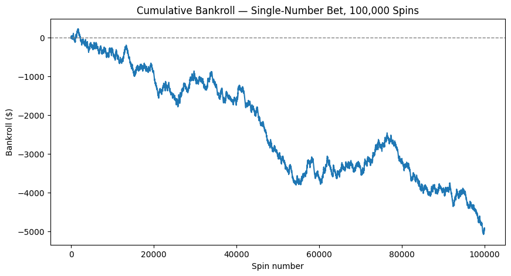
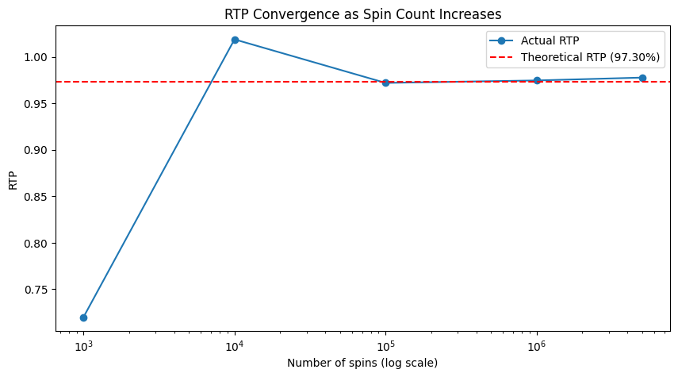

# roulette-rtp-simulation
# Roulette RTP Simulation

Monte Carlo simulation of European roulette, calculating Return to Player (RTP) and house edge for multiple bet types, with a convergence analysis showing how simulated results approach theoretical values as sample size increases.

## Problem Statement

Casino games are priced through mathematics: every bet carries a built-in house edge derived from its payout odds versus its true probability of winning. This project models a European roulette wheel, simulates 100,000+ spins, and confirms that the simulated RTP converges to the theoretical RTP calculated by hand.

## How to Run

1. Open [Google Colab](https://colab.research.google.com)
2. Upload `roulette_simulation.ipynb` (or copy the cells from this repo)
3. Run all cells top to bottom (Runtime → Run all)

## Rules Modeled

European roulette (single-zero): 37 pockets (0–36), single-number bet pays 35:1, red/black pays 1:1. House edge comes entirely from the green 0 pocket.

## Results (100,000 spins, single-number bet)

| Metric | Theoretical | Actual (this run) |
|---|---|---|
| RTP | 97.2973% | 95.0760% |
| House edge | 2.7027% | 4.9240% |

The gap is explained by variance, not a bug: a single-number bet only wins ~1 in 37 spins, so a small shortfall in win count produces a large swing in RTP over 100,000 spins.

## Convergence Analysis

| Spins | Actual RTP | Theoretical RTP | Difference |
|---|---|---|---|
| 1,000 | 72.0000% | 97.2973% | -25.297 pp |
| 10,000 | 101.8800% | 97.2973% | +4.583 pp |
| 100,000 | 97.2000% | 97.2973% | -0.097 pp |
| 1,000,000 | 97.4628% | 97.2973% | +0.166 pp |
| 5,000,000 | 97.7717% | 97.2973% | +0.474 pp |

At low spin counts, actual RTP swings wildly in either direction. By 100,000+ spins, the deviation narrows to well under half a percentage point, consistent with the law of large numbers — though convergence is not perfectly monotonic even at 5,000,000 spins, since variance never fully disappears, only shrinks.

## Debugging Notes

An early version of the convergence analysis produced a table and a plot that disagreed at low spin counts, because each was generated from an independent random draw instead of a shared one. Fixed by generating the random outcomes once per spin count and reusing that same data for both the table and the plot.

## Tools

Python, NumPy, Pandas, Matplotlib — built and run in Google Colab.
